# koi

A quiet koi pond for your terminal.

Five koi drift, glide and turn lazily over a painted garden pond. Drop food and they gather to eat. Reach into the water and one comes over to nuzzle your hand. There is no score, no goal and nothing to lose. Soft music plays, the water ripples where things land, and the light moves from dawn to night if you want it to.

koi draws with the Kitty graphics protocol, so the pond is real images, not text characters.

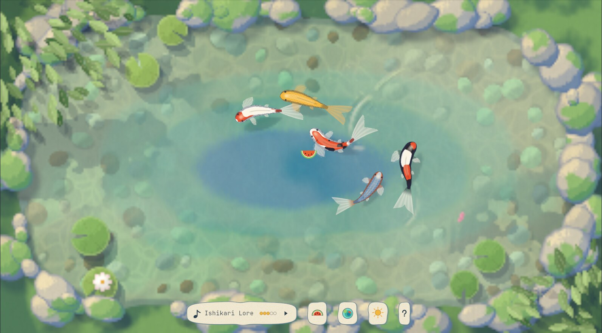

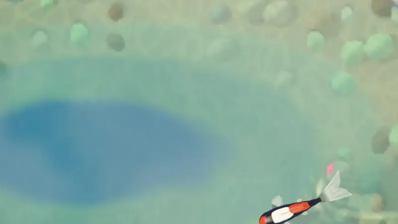

## Install

koi runs on Linux in a terminal with the Kitty graphics protocol, such as [Ghostty](https://ghostty.org) or [Kitty](https://sw.kovidgoyal.net/kitty/).

Download the archive for your machine (`x86_64` or `aarch64`) from the Releases page, unpack it and run `koi`:

```sh
tar xzf koi-0.1.0-x86_64-linux.tar.gz
./koi-0.1.0-x86_64-linux/koi
```

The binary is one file of about 14 MB with three pieces of music built in. It needs glibc 2.17 or newer and `libasound.so.2`, which every Linux desktop has. A GPU is optional: koi renders with Vulkan when it can and on the CPU when it can't, and both look the same. Put `koi` anywhere on your `PATH`, such as `~/.local/bin`.

If your terminal can't show the images, koi says so and exits. That includes a terminal without the Kitty protocol, and any terminal over SSH, since the images travel through shared memory on the same machine.

### More music

koi comes with three tracks. The full set of 19 calm tracks by Kevin MacLeod is a separate download of about 180 MB. From a checkout of this repository:

```sh
scripts/fetch-music.sh
```

This downloads them into `~/.local/share/koi-pond/music`, where koi looks first. It needs `curl` and `jq`. You can also point `audio.music_dir` in the config at any folder of mp3 and ogg files.

### Build from source

```sh
sudo apt install libasound2-dev    # ALSA headers, for Debian and Ubuntu
cargo build --release
target/release/koi
```

This needs Rust 1.88 or newer.

## Playing

Click the water to drop food, or press `f` to drop it somewhere random. Press or hold on a koi to pet it. Everything else is optional.

| Key | What it does |
|---|---|
| click, `f` | Drop food where you click, or somewhere random |
| press on a koi | Pet it. Hold to keep your hand in the water, drag and it follows |
| `p` | Offer a hand in the middle of the pond |
| `1` to `5` | Pick the food: pellets, flakes, petals, seeds, treat |
| `t`, `T` | Next or previous scene |
| `l`, `L` | Later or earlier time of day |
| `n`, `m`, `+`, `-` | Next track, mute, volume |
| `Tab` | Hide or show the HUD |
| `?` | Show the help card |
| `q`, Ctrl-C | Quit |

`koi --help` lists every key and flag. The pond remembers your theme, volume and mute between runs.

### Food

Each food behaves differently, and the koi notice the splash and come over.

| Key | Food | What the koi do |
|---|---|---|
| `1` | Pellets | The nearest koi rushes over and gulps them. |
| `2` | Flakes | Several koi come over slowly and graze. |
| `3` | Petals | A koi mouths each one once, then ignores it. |
| `4` | Seeds | They sink in a spiral, and koi follow them down. |
| `5` | Treat | Every koi circles it, and they take turns biting it. |

### Petting

Press on a koi and it slows, turns to face your hand and nuzzles it, tail fluttering, while a soft ring spreads from your fingers and a few bubbles rise. Let go and it lingers nearby for a while before it drifts off. Other koi sometimes come over to see. Koi you have petted come to your hand a little more readily for a while.

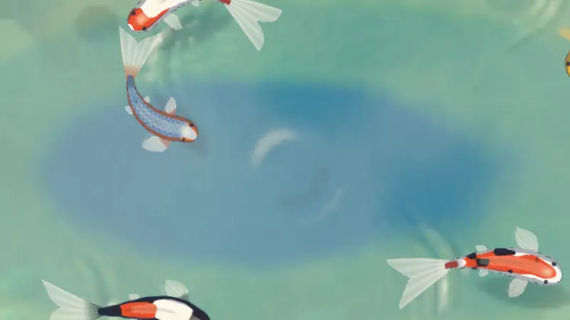

### The HUD

A row of painted stones sits at the bottom of the window: the music pill with the track title and volume, then food, scene, time of day and help. Click a stone to open a tray of choices.

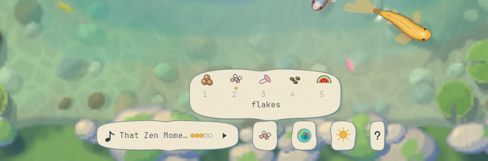

`Tab` hides the row. With `hud.show = "auto"` in the config it stays hidden and each stone peeks up for a moment when you use its key.

## Themes

There are 12 themes: nine painted and three pixel art. `t` steps through the scenes and `l` through the times of day within one. Morning Mist, Summer Garden, Evening Garden and Moonlit Pond are one garden at dawn, noon, evening and night, so `l` takes the same pond through the day while the koi keep swimming.

| Morning Mist | Evening Garden | Moonlit Pond |
|---|---|---|
| 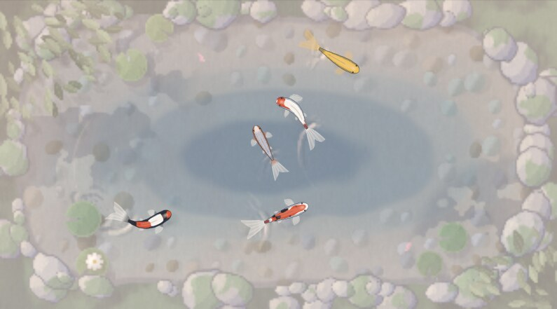 | 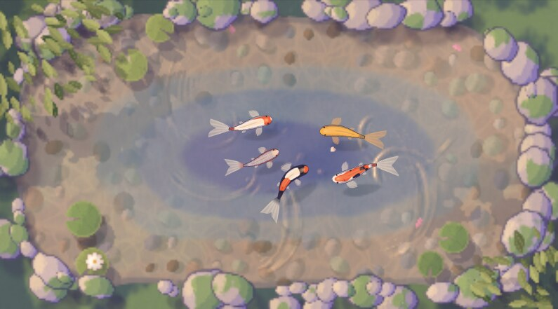 | 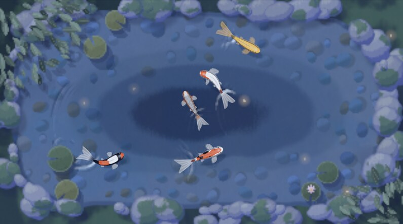 |
| **Rainy Afternoon** | **Ink and Vermilion** | **Petal Spring** |
| 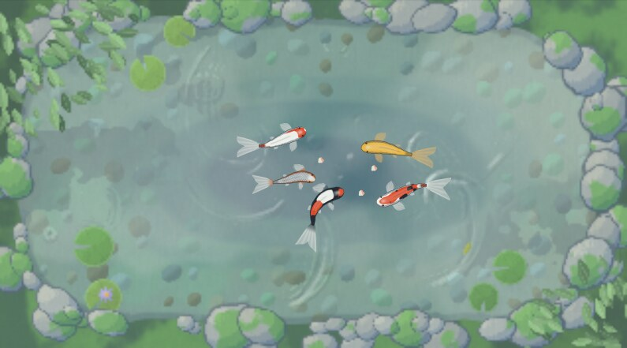 | 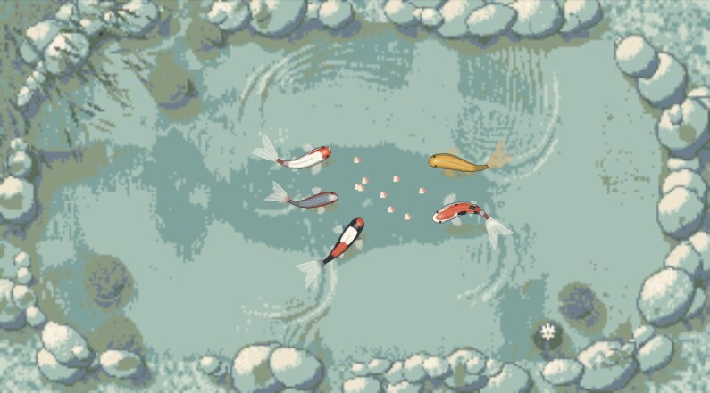 | 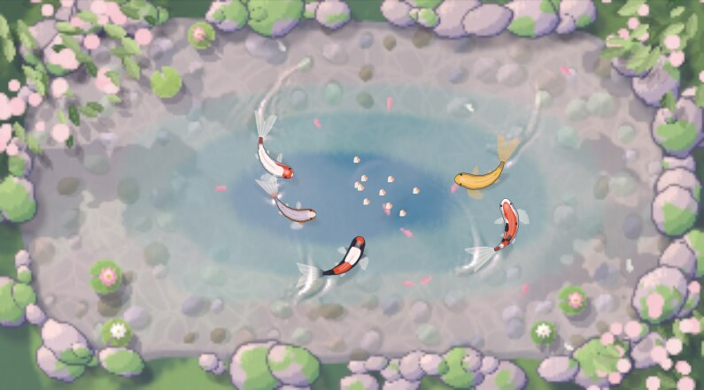 |

The pixel themes put the water and the koi on one grid of art pixels and scale it up without blurring.

| Hillside Summer | Lantern Dusk | Pocket Moss |
|---|---|---|
| 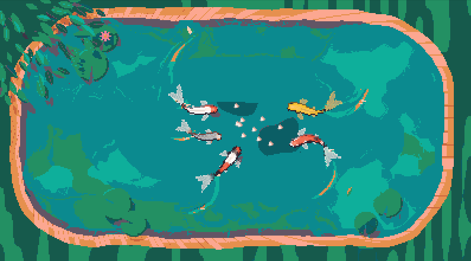 | 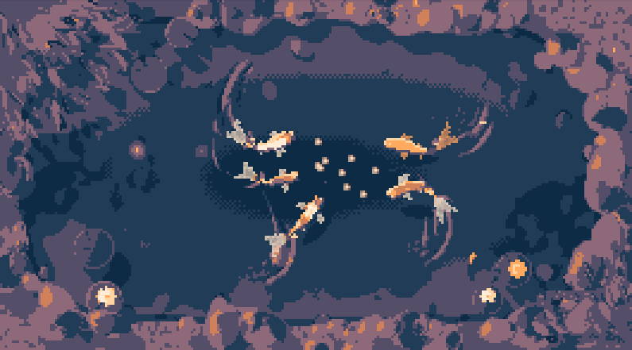 | 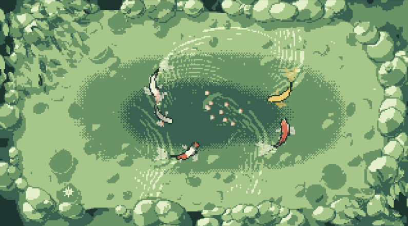 |

### Your own theme

A theme is a TOML file that lists only what it changes. Save this as `~/.config/koi-pond/themes/autumn-evening.toml` and it joins the cycle:

```toml
name = "Autumn Evening"
description = "Evening Garden with maple leaves on the water."
extends = "evening-garden"

[palette]
koi_red = "#D9481F"

[scene]
foliage_kind = "maple"
petal_kinds = ["maple", "leaf"]
petals = 12
```

Save a theme while koi runs and the pond repaints in place. A mistake shows as a warning on the top line and the last good theme stays. [docs/THEMES.md](docs/THEMES.md) describes every key, and [themes/summer-garden.toml](themes/summer-garden.toml) lists them all with their defaults.

## Configuration

Everything has a default, so there is nothing to set up. To change something, start from the full config with a comment on every key:

```sh
mkdir -p ~/.config/koi-pond
koi --print-default-config > ~/.config/koi-pond/config.toml
```

For example:

```toml
[pond]
koi = 8
calmness = 1.5     # lazier turns and longer glides

[render]
backend = "cpu"

[audio]
volume = 0.4
```

A bad value never stops the game: it shows as a warning naming the file and key, and the default is used. Most changes apply while koi runs. [docs/ARCHITECTURE.md](docs/ARCHITECTURE.md#config-keys) has a table of every key.

## tmux

koi runs inside tmux 3.3 or newer when tmux passes images through to the terminal. Add this line to your tmux config (`~/.tmux.conf` or `~/.config/tmux/tmux.conf`), and run it once as `tmux set -g allow-passthrough on` for the server that is already running:

```
set -g allow-passthrough on
```

The pond then stays in its pane through splits and window switches. Without the setting, koi prints the line above and exits. Inside tmux each frame is one image of the whole pane, so it costs more than running directly in the terminal. [docs/ARCHITECTURE.md](docs/ARCHITECTURE.md#tmux) explains how it works.

## How it works

Each frame, koi steps the simulation at a fixed 60 Hz, renders the water into one low-resolution image and poses each koi into its own small sharp image, placed to the screen pixel. The images go to the terminal through shared memory, so the tty carries only short escape codes, and only images that changed are sent. The water and koi shaders run on the GPU with wgpu, and the CPU path does the same math. A test holds the two within 2/255 per channel.

The frame rate adapts: up to 60 frames a second while the window is focused or something is happening, and 8 when it is in the background and calm. Most of the cost of a smooth pond is the terminal drawing it, not koi. [docs/PERFORMANCE.md](docs/PERFORMANCE.md) has the measurements.

| Crate | What it does |
|---|---|
| `koi-sim` | The koi and the food: steering, moods, feeding and petting. No GPU, terminal or audio code. |
| `koi-theme` | Reads themes, resolves `extends` and steps through scenes and times. |
| `koi-render` | Renders the water and the koi on the GPU or the CPU, and paints food sprites and HUD stones. |
| `koi-term` | Raw mode, input parsing and sending images through shared memory. |
| `koi-audio` | Music with crossfades, a generated ambient layer and the chimes. |
| `koi-pond` (`src/`) | The `koi` binary: the frame loop, config, HUD and image layers. |

[docs/ARCHITECTURE.md](docs/ARCHITECTURE.md) goes through the frame loop, each crate's API and every test. [docs/STYLE.md](docs/STYLE.md) covers the art direction.

## Development

```sh
cargo test --workspace
cargo clippy --workspace --all-targets
```

The tests that compare the GPU and CPU renderers run when `VK_ICD_FILENAMES` names a Vulkan driver. lavapipe, a Vulkan driver that runs on the CPU, works anywhere:

```sh
VK_ICD_FILENAMES=/usr/share/vulkan/icd.d/lvp_icd.json cargo test --workspace
```

`scripts/vshot.sh` runs koi in Ghostty on a private virtual display and saves a screenshot and a short clip, without anything appearing on your screen. `scripts/release.sh` builds the release archives for x86_64 and aarch64 with [cargo-zigbuild](https://github.com/rust-cross/cargo-zigbuild), linked against glibc 2.17. `scripts/release.sh --music` also packs the full music set.

## Credits and license

The music is by Kevin MacLeod ([incompetech.com](https://incompetech.com)), licensed under [Creative Commons: By Attribution 4.0](https://creativecommons.org/licenses/by/4.0/). [assets/music/CREDITS.md](assets/music/CREDITS.md) lists every track. The pixel themes use Resurrect 64 by Kerrie Lake and SLSO8 by Luis Miguel Maldonado.

koi is licensed under either the [MIT license](LICENSE-MIT) or the [Apache License 2.0](LICENSE-APACHE), at your option.
