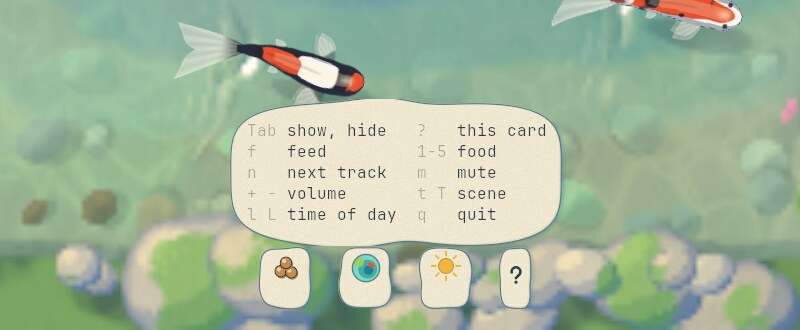

# koi

koi is a top-down koi pond that runs in a terminal window. Koi swim, drift and glide over a painted garden pond, and you can drop food for them. There is no score, no goal and nothing to lose. It draws with the Kitty graphics protocol, so the pond is made of real images rather than text characters, painted in the style of a hand-drawn animated film.


## Features

- Five koi with their own moods. They wander, glide, turn lazily and dart when something lands.
- Five kinds of food, each with its own behavior (see [Food](#food)).
- 12 built-in themes: nine painted and three pixel art. Four of them are one garden at dawn, noon, evening and night.
- Themes are TOML files. Yours can extend a built-in and change only a few colors.
- A small HUD of painted stones for food, scene, time of day and music, along the bottom of the window.
- Music, a generated ambient layer and a chime when food lands.
- Renders on the GPU with wgpu, or on the CPU when there is no GPU. Both paths draw the same picture.
- Drops to 8 frames per second when the window is unfocused and the pond is calm.
- Hot reload: edit a theme or the config and the pond updates while it runs.
- Runs inside tmux, with one config line in tmux (see [tmux](#tmux)).

## Requirements

- Linux. The images go to the terminal through shared memory in `/dev/shm`.
- A terminal with the Kitty graphics protocol and shared-memory transfer (`t=s`). koi is tested in [Ghostty](https://ghostty.org). Kitty should work, but I have not tried it.
- Rust 1.88 or newer.
- ALSA headers for audio (`libasound2-dev` on Debian and Ubuntu). docs/ARCHITECTURE.md describes a workaround if you cannot install them.
- A GPU with Vulkan is optional. Without one, koi renders on the CPU.

## Install and run

```sh
cargo build --release
target/release/koi
```

The music is not in git. To download the 19 tracks listed in `assets/music/tracks.json`:

```sh
scripts/fetch-music.sh
```

Without them the pond still plays the ambient layer and the feeding chimes. The script needs `curl` and `jq`.

| Flag | What it does |
|---|---|
| `--theme NAME` | Start in this theme. |
| `--list-themes` | List the themes with their family and time of day. |
| `--config PATH` | Read this config file instead of the default one. |
| `--print-default-config` | Print the full config with every key and a comment. |

The pond remembers the last theme, the volume and mute between runs, in `$XDG_STATE_HOME/koi-pond/state.toml`.

## Keys

| Key | What it does |
|---|---|
| click, `f` | Drop food where you clicked, or somewhere random |
| `1` to `5` | Pick the food: pellets, flakes, petals, seeds, treat |
| `Tab` | Hide or show the HUD |
| `?` | Show the help card |
| `Esc` | Close a tray or the card, and with `hud.show = "auto"` the HUD |
| `t`, `T` | Next or previous scene |
| `l`, `L` | Later or earlier time of day in the scene |
| `n` | Next track |
| `m` | Mute |
| `+`, `-` | Volume |
| `r` | Reload the config and themes |
| `d` | Show the frame rate, backend and theme on the top line |
| Ctrl-L | In tmux, write the pond's cells again |
| `q`, Ctrl-C | Quit |

Every key except `Esc`, Ctrl-C and Ctrl-L can be changed in the `[input]` section of the config.

## The HUD

The HUD is a row of stones at the bottom of the window: a music pill with the track title and volume, then stones for food, scene, time of day and help. The music pill shows only when audio is on and found music.

`hud.show` sets when the row is on screen:

| Value | What it does |
|---|---|
| `"always"` (default) | The row stays on screen. Trays and the help card open and close as usual. |
| `"auto"` | The row is hidden. A key such as `2` shows only the stone it changed, with a one-word label, for 3 seconds. |
| `"hidden"` | Nothing is drawn. The keys still work. |

`Tab` switches between `"always"` and `"auto"` until you quit. In `"auto"`, a row shown by hover fades 4 seconds after your last HUD input. A window under 14 rows has no room for the row and only shows the single-stone peeks.

Click the food, scene or time stone to open a tray of choices above it.


`?` shows the help card:



These were taken with audio off, so the music pill is not there. With `hud.hover = true`, resting the pointer in the bottom 4 rows for half a second shows the row.

### Food

Click the water to drop food there, or press `f` to drop it somewhere random. The koi notice the splash and come over.

Food always lands in open water: a click on the rim stones drops it in the nearest open water.

| Key | Food | What the koi do |
|---|---|---|
| `1` | Pellets | The nearest koi rushes over and gulps them. |
| `2` | Flakes | Several koi come over slowly and graze. |
| `3` | Petals | A koi mouths each one once, then ignores it. |
| `4` | Seeds | They sink in a spiral, and koi follow them down. |
| `5` | Treat | Every koi circles it, and they take turns biting it. |

## Themes

There are 12 built-in themes. `t` steps through the scenes and `l` steps through the times of day within one. The garden family has four times, so `l` moves it from dawn to night while the koi keep swimming. `koi --list-themes` lists them all, and [docs/STYLE.md](docs/STYLE.md) describes each one.

| Morning Mist | Evening Garden | Moonlit Pond |
|---|---|---|
|  |  |  |
| **Rainy Afternoon** | **Ink and Vermilion** | **Petal Spring** |
|  |  |  |

Three themes are pixel art. The water and the koi share one grid of art pixels, and koi scales them up itself by repeating pixels, so the terminal does not blur them.

| Hillside Summer | Lantern Dusk | Pocket Moss |
|---|---|---|
|  |  |  |

All of these are a 160x45 Ghostty window with the same seed, rendered on lavapipe (software Vulkan).

### Writing your own

Your themes go in `~/.config/koi-pond/themes/<id>.toml` (or under `$XDG_CONFIG_HOME`). A theme lists only what it changes. This one takes Evening Garden and gives it maple leaves and a deeper red koi:

```toml
name = "Autumn Evening"
description = "Evening Garden with maple leaves on the water."
extends = "evening-garden"

[palette]
koi_red = "#D9481F"

[scene]
foliage_kind = "maple"
petal_kinds = ["maple", "leaf"]
petals = 12
```

A theme without `extends` extends Summer Garden, the root theme. `name`, `description`, `family`, `time`, `credit` and `hidden` belong to the file they are in and are not inherited. A file with a built-in's id replaces that built-in.

A theme has four tables:

| Table | What it holds |
|---|---|
| `[palette]` | Named colors: water depths, stones, lily pads, koi colors, food and HUD text. |
| `[light]` | Sun direction, warm and cool shading, shadow length, overcast. |
| `[style]` | How it is drawn: pixel size, tone steps, outlines, grain, dither, caustics, glints. |
| `[scene]` | What is in it: pond floor, rim, bank, pads and flowers, foliage, drifting petals, weather. |

[themes/summer-garden.toml](themes/summer-garden.toml) has every key with its default and a comment. [docs/THEMES.md](docs/THEMES.md) explains what each key does. Save the file while koi is running and the pond repaints in place. A mistake in a theme shows as a warning on the top line, and koi keeps the last good theme.

## Configuration

The config file is `~/.config/koi-pond/config.toml` (or `$XDG_CONFIG_HOME/koi-pond/config.toml`). `--config PATH` reads another file. Every key is optional. `koi --print-default-config` prints the whole file with a comment on every key, which is the easiest place to start:

```sh
mkdir -p ~/.config/koi-pond
target/release/koi --print-default-config > ~/.config/koi-pond/config.toml
```

| Section | What it sets |
|---|---|
| `[fps]` | The frame rate while focused and while unfocused and calm, and what counts as activity. |
| `[render]` | GPU or CPU backend, image resolution for the water and the koi, and tmux mode. |
| `[pond]` | Number of koi, speed, calmness, and a seed to repeat the same pond. |
| `[theme]` | The starting theme. |
| `[hud]` | When the HUD shows, hover reveal, alignment, fading and timing. |
| `[audio]` | On or off, music folder, volumes, chimes, loudness normalization. |
| `[input]` | Mouse feeding and every key. |

An example:

```toml
[pond]
koi = 8
calmness = 1.5     # lazier turns and longer glides

[render]
backend = "cpu"

[hud]
hover = true

[audio]
volume = 0.4
```

A bad value does not stop the game. It shows as a warning on the top line naming the file and key, prints again on exit, and the default is used. Changes to `[fps]`, `[input]`, `[theme]`, `[hud]`, `pond.speed` and `pond.calmness` apply while the game runs. `[render]`, `[audio]`, `hud.hover`, `input.mouse`, `pond.koi` and `pond.seed` apply on the next start. docs/ARCHITECTURE.md has a table of every key.

## tmux

koi runs inside tmux if tmux passes the graphics commands through to Ghostty. Turn it on for the running server with `tmux set -g allow-passthrough on`, and add this line to your tmux config (`~/.tmux.conf` or `~/.config/tmux/tmux.conf`) to keep it:

```
set -g allow-passthrough on
```

Without it koi prints that line and exits, since the pane would stay blank. tmux 3.3 or newer is needed. I tested with tmux 3.4.

tmux does not know where images are, so koi draws differently there. Each frame the water, koi, food and HUD stones are drawn into one image the size of the pane, sent through tmux, and shown through special placeholder characters that koi writes into the pane. tmux keeps those characters with the pane, so the pond stays in its pane when you split the window, and it hides and comes back when you switch tmux windows. The HUD text is ordinary text on a background colour taken from the stone under it. Clicks and scrolling work as usual.

This costs more than outside tmux. The whole pane is sent every frame (about 5.5 MB per frame for a 160x45 window at 10 pixels per cell), and the frame is put together on the CPU, even with the GPU backend. On a HiDPI screen `render.fish_px = 8` makes the frame much smaller, since in tmux it sets the pixels per cell of the whole frame, not just the koi. `render.tmux = "off"` turns this mode off, and `"on"` turns it on even when `$TMUX` is not set.

koi drops to 8 frames per second when the pane loses focus only if tmux reports focus changes, which needs `set -g focus-events on`. If tmux redraws the pane and the pond goes missing, press Ctrl-L.

## How it works

koi is a Cargo workspace. The binary is the frame loop, and the libraries under `crates/` do the rest:

| Crate | What it does |
|---|---|
| `koi-sim` | The koi and the food: steering, moods and feeding. Plain Rust with no GPU, terminal or audio code. |
| `koi-theme` | Reads theme files, resolves `extends` chains, derives palette colors and steps through scenes and times. |
| `koi-render` | Renders the water and poses each koi, on the GPU (wgpu compute shaders) or the CPU. Also paints the food sprites and the HUD stones. |
| `koi-term` | Raw mode, input parsing, and sending images through a ring of shared-memory files. |
| `koi-audio` | Music with crossfades, the generated ambient layer and the chimes, on their own threads. |
| `koi-pond` (root, `src/`) | The `koi` binary: arguments, config, the frame loop, the HUD and the Kitty image layers. |

Each frame:

1. Wait until the next frame is due, or until input arrives.
2. Hand input to the HUD, then handle clicks and keys.
3. Step the simulation in fixed 1/60 s steps up to the frame time. Food landing, food being eaten and koi wakes make splashes that disturb the water, and the water steps too.
4. Render the water into one image. The terminal scales it up to fill the window.
5. Pose every koi into its own small image at screen resolution, placed to the screen pixel. The fraction of a pixel left over goes into the pose, so slow koi still move evenly.
6. Send only the images that changed, inside one synchronized update. If nothing changed, write nothing.

The water is a low-resolution image (2 pixels per cell by default) and the koi are sharp images on top of it. Each image is written to a shared-memory file, and the terminal gets a short escape code naming the file, so the tty never carries pixels. The HUD stones are images too, behind ordinary terminal text.

`water.wgsl` and `koi.wgsl` run as wgpu compute passes on Vulkan, and the CPU path does the same math in Rust. A test renders one fixed frame in eight themes on both paths and requires them to match within 2/255 per channel. With `backend = "gpu"` and no Vulkan adapter, koi falls back to the CPU and says so on the top line.

The frame rate adapts. While the window is focused, or while something is happening (pellets in the water, recent input, fresh ripples, a koi darting, the HUD fading), koi sends up to 60 frames per second. When the window is unfocused and the pond is calm, it drops to 8. The simulation runs at 60 Hz regardless, so the koi move the same way at either rate. `d` shows the current rate and the reason for it.

[docs/ARCHITECTURE.md](docs/ARCHITECTURE.md) has the frame loop step by step, the public API of each crate, every config key and every test. [docs/STYLE.md](docs/STYLE.md) has the art direction and the themes.

## Performance

Most of the cost of an animated pond is in the terminal, not in koi. Before building koi I measured prototypes in a 160x45 Ghostty window under XWayland, with CPU in percent of one core. [docs/PERFORMANCE.md](docs/PERFORMANCE.md) has the full table.

| Prototype | Ghostty | Game | Total |
|---|---|---|---|
| Changing one text cell at 60 fps (the floor) | 23% | 0.2% | 23% |
| Full-window image at 8 px per cell, CPU render | 50% | 99% | 149% |
| Same, GPU render | 44% | 3.5% | 48% |
| Water at 2 px per cell plus one image per koi, CPU render | 27% | 13% | 40% |

koi uses the last layout with GPU rendering and the adaptive frame rate. From those numbers, a focused pond at 60 fps should cost about 27 to 30% of a core in total, most of it Ghostty. Ghostty spends about 23% of a core on any content that changes 60 times a second, so no 60 fps design gets far below that. An unfocused calm pond at 8 fps should cost less than 10%. These are estimates from the prototypes. I have not measured the finished game the same way.

On the CPU backend, posing a koi costs the square of its resolution, so on a HiDPI screen `fish_px = 0` is capped at 10 image pixels per cell. Set `render.fish_px` lower if the CPU path cannot hold the frame rate.

## Music

The music is by Kevin MacLeod ([incompetech.com](https://incompetech.com)), licensed under [Creative Commons: By Attribution 4.0](https://creativecommons.org/licenses/by/4.0/). [assets/music/CREDITS.md](assets/music/CREDITS.md) lists every track with its source. `audio.music_dir` points koi at your own folder of mp3 and ogg files instead.

The pixel theme palettes are credited in their theme files: Resurrect 64 by Kerrie Lake and SLSO8 by Luis Miguel Maldonado.

## Development

| Path | What is there |
|---|---|
| `src/` | The `koi` binary. |
| `crates/` | The five library crates. |
| `themes/` | The built-in themes, compiled into the binary. Debug builds read them from disk, so edits show without a rebuild. |
| `assets/music/` | Track list and credits. The mp3 files are downloaded by `scripts/fetch-music.sh`. |
| `docs/` | Architecture, style and these screenshots. |
| `research/` | The style system, the HUD spec and the design notes behind them. |
| `proto/` | The prototypes and performance measurements. They are separate crates, excluded from the workspace. |
| `scripts/` | `fetch-music.sh` and `vshot.sh`. |

```sh
cargo test --workspace
cargo clippy --workspace --all-targets
cargo doc --workspace --no-deps
```

`cargo test -p koi-sim` runs the simulation tests alone, without building wgpu or rodio. The tests that compare the GPU and CPU paths touch a GPU only when `VK_ICD_FILENAMES` names a Vulkan driver, and then they fail if no adapter is found. To run them on lavapipe, the CPU-based Vulkan driver:

```sh
VK_ICD_FILENAMES=/usr/share/vulkan/icd.d/lvp_icd.json cargo test --workspace
```

`scripts/vshot.sh` runs a command in Ghostty on a private Xvfb display, with software GL, lavapipe and audio off, then saves a screenshot and a 3 second clip. Nothing appears on your screen. It needs Xvfb, xdotool, ImageMagick and ffmpeg:

```sh
scripts/vshot.sh /tmp/shot 5 target/release/koi --theme lantern-dusk
```

CPU numbers from vshot runs are not representative, since everything renders in software.
