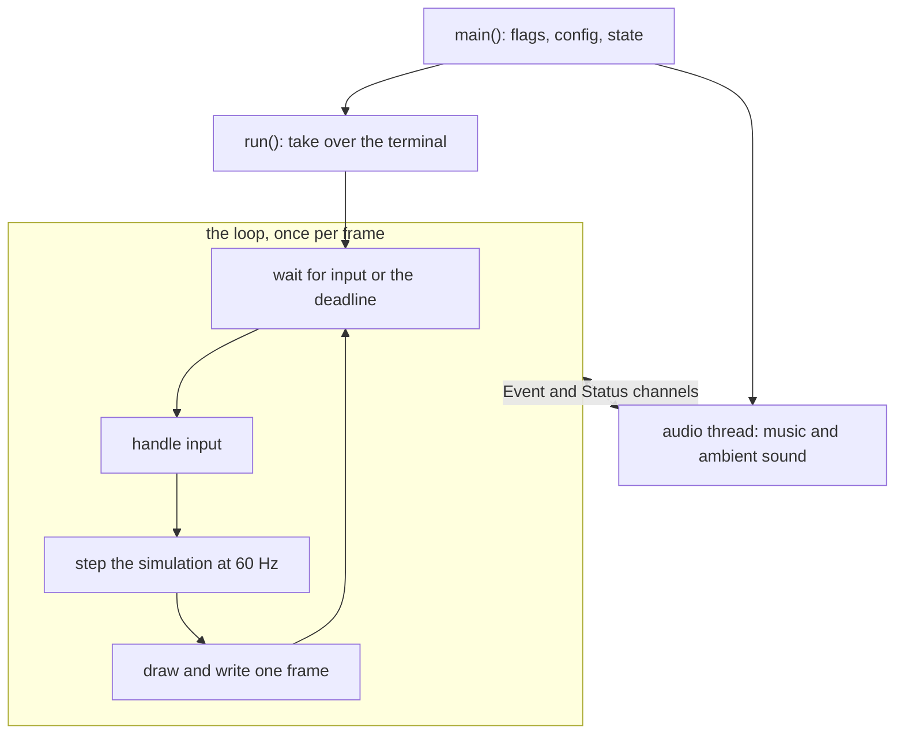

# Runtime spine

> What happens between launching koi and a frame showing up in the terminal?

koi runs one main loop. `main` reads the flags and the config, starts a separate audio thread, and hands off to `run`. `run` takes over the terminal and repeats four steps once per frame: wait for input or the next frame's deadline, handle the input, step the simulation, then draw and write the whole frame at once.

The simulation always steps at 60 Hz, whatever the frame rate. When the pond is calm and drops to 8 frames a second, the koi still swim at the same speed. Only the drawing slows down.

Audio lives on its own thread and only exchanges messages with the loop.

::: medium

### Launch

`main` (`src/main.rs:61`) builds everything: config, renderer, remembered state, audio. It passes them all to `run`. The GPU and audio arrive as `Option`s, so when either is missing `run` just gets `None`.

The first thing `run` does is take over the terminal:

@excerpt src/main.rs:375

`_terminal` is never used again. It's a guard: when it goes out of scope, its `Drop` restores the terminal (`crates/koi-term/src/lib.rs:86-89`). That happens on a normal return, an error, or a panic, so no exit path can skip the cleanup.

### One frame

The loop starts at `src/main.rs:417`.

1. **Wait.** It picks a frame rate (60 if something is happening, 8 if the pond is calm), then blocks on input until the next frame is due (`src/main.rs:443`). A key or click wakes it early, so input feels instant even at 8 frames a second.
2. **Handle input.** The HUD gets first pick of keys and clicks. The rest go to the pond: feed, pet, change scene.
3. **Step the simulation.** This is a fixed-timestep loop. The loop works out how far the simulation is behind the frame's time, and `advance` steps it in exactly 1/60 s steps:

@excerpt src/main.rs:685-689 mark=688-689

@excerpt crates/koi-render/src/frame.rs:14-30 mark=17,29

   The frame's time is when it was *due*, not when the loop woke, so frames stay evenly spaced. The cap of 60 steps means a long stall, like a suspended laptop, skips ahead instead of replaying every missed step.

4. **Draw and write.** Each koi is drawn between its last two steps, so motion stays smooth between ticks (`src/main.rs:753`). The whole frame goes into one buffer, wrapped in `\x1b[?2026h` and `\x1b[?2026l`. That pair asks the terminal to hold the screen until the frame is complete, so you never see half of one.

### Threads

The main loop owns all the pond's state. The audio thread owns everything about sound. They share nothing and talk through two channels: `Event` goes to the audio thread (next track, volume, night), and `Status` comes back (now playing, errors). The loop reads `Status` with `try_recv` once per frame (`src/main.rs:694`), so a slow audio thread can't delay a frame. That's why there are no locks around the pond.

::: check You press `n` for the next track. Which thread decodes the song, and how does its name reach the screen?
The loop sends `Event::NextTrack` down the channel. The audio thread decodes and starts the song, then sends back `Status::NowPlaying { title }`. On a later frame the loop picks that up and calls `hud.track` (`src/main.rs:696`).
:::
:::

::: high
### When the terminal can't keep up

The loop times each write. If writing a frame takes longer than the frame interval, the frame rate ceiling halves, down to 8. Every 2 s it climbs back by a quarter:

@excerpt src/main.rs:799-812

If it stays at 8 for 5 s on one of the heavier drawing methods, koi switches to a simpler one. That switch reuses the window-resize path (`src/main.rs:648`).

### One stepping function, two clocks

The browser version has no loop of its own. The page calls `requestAnimationFrame` (`site/main.js:141`), and each callback calls `Pond::tick`, which hands `advance` the same kind of gap in seconds:

@excerpt crates/koi-web/src/lib.rs:193-196 mark=195

Only the clocks differ. The terminal sleeps until a deadline it computes with `Instant`. The browser wakes koi on its own schedule and hands over a timestamp in milliseconds. Each front end turns its own clock into "seconds behind", and the stepping itself lives once, in `koi-render`, beside the drawing code both front ends share. A test pins down its contract: whole steps, the remainder left for next time, and the jump after a long pause (`crates/koi-render/src/frame.rs:195`).

Both front ends can drive the same simulation because it depends on nothing. Its manifest has no dependencies at all, so it can't reach a terminal, a GPU or a browser:

@excerpt crates/koi-sim/Cargo.toml:1-8

### Finding your way around `run`

`run` is one function, from `src/main.rs:321` to the end of the file, about 515 lines. The loop, input, hot reload, resize, fallback and stats all live there, in frame order, with a comment at each stage. Search for the comments rather than for function names.
:::
