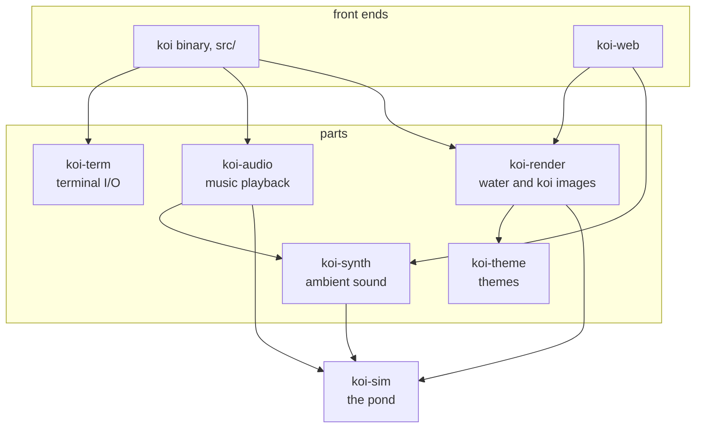

# Modularity

> How is the code split up, and who is allowed to depend on whom?

koi is a Cargo workspace: seven library crates and the `koi` binary. Each crate can only use what its own Cargo.toml lists, and the compiler enforces that.

At the bottom is `koi-sim`, the pond itself: koi, food, petting. It depends on nothing, so it can't reach a terminal, a GPU or a speaker even by accident. Drawing, sound, themes and terminal handling each live in their own crate on top of it.

Two front ends put the pieces together. The `koi` binary uses everything for the terminal. `koi-web` uses the same simulation, themes, renderer and synth for the browser, and leaves out the terminal and the audio device code.

::: medium

Arrows point at what a crate depends on. Both front ends also use `koi-sim` and `koi-theme` directly; those arrows are left out to keep the picture readable.

### Where to look for what

| To change | Look in |
|---|---|
| How koi move, eat and react to petting | `koi-sim` |
| How the water and koi are painted | `koi-render`, plus the `.wgsl` shaders for the GPU path |
| Colours, light and scenes | `themes/*.toml`, loaded by `koi-theme` |
| The generated ambient sound | `koi-synth` |
| Music playback and crossfades | `koi-audio` |
| Keys, mouse, and getting images onto the terminal | `koi-term`, then `src/layers.rs` |
| The frame loop, HUD and config | `src/` |
| The web page | `koi-web` and `site/` |

The browser build's manifest shows the split directly. It lists the four crates it shares, and nothing that touches a terminal or an audio device:

@excerpt crates/koi-web/Cargo.toml:14-19

::: check You want to put the pond in a native desktop window. Which crates would you reuse, and which would you replace?
Reuse `koi-sim`, `koi-theme` and `koi-render` for the pond and its images, and `koi-synth` and `koi-audio` for sound. Replace `koi-term` and `src/`, which only exist to talk to a terminal. That's the same cut `koi-web` makes.
:::
:::

::: high
### One boundary that looks misplaced

The water's height field lives in `koi-render`, not in `koi-sim`, even though it's simulation. On the GPU path the water is stepped by a shader, in GPU buffers, so it has to sit where the GPU code is. `koi-sim` only produces the splashes that disturb it. The architecture doc says the same (`docs/ARCHITECTURE.md:18`).

### Versions in one place

Shared versions are set once in the root manifest (`Cargo.toml:13-32`), and a crate opts in with `workspace = true`, so the crates that share wgpu or serde get the same version. A dependency only one crate uses is listed there directly, like `wasm-bindgen` in `crates/koi-web/Cargo.toml:19`.
:::
