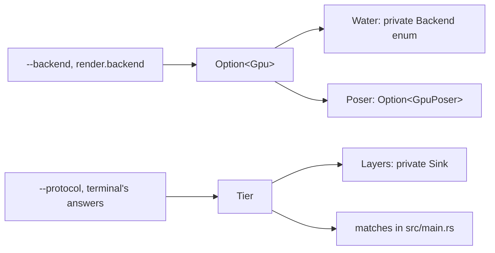

# Seams and abstraction

> Where can behaviour be swapped?

koi defines no traits. Where behaviour varies, it uses an enum or an `Option`. It picks a value once, keeps it, and matches on it wherever the behaviour differs.

There are three of these choices. The GPU or the CPU draws the water and the koi, chosen once at startup. A tier decides how images reach the terminal: Kitty graphics, sixel, or coloured half-block characters. It's chosen at startup and again when the window resizes or a tier fails. And the Unix or Windows system code is chosen when koi is compiled.

Two more seams aren't choices at all. The audio thread can only be reached through channels. And the terminal binary and the web page are two front ends over the same simulation and renderer.

::: medium

### GPU or CPU

`main` decides once. If the GPU won't open, that's a warning and `None`:

@excerpt src/main.rs:163-172 mark=164-169

After that the choice travels as `Option<&Gpu>`. `Water::new` turns it into its private enum (`crates/koi-render/src/water.rs:290-292`), and `step` and `render` match on that enum each frame (`crates/koi-render/src/water.rs:448`, `crates/koi-render/src/water.rs:556`). `Poser` keeps an `Option<GpuPoser>` instead and checks it when it poses a koi (`crates/koi-render/src/koi.rs:258`). The web page always passes `None` (`crates/koi-web/src/lib.rs:150`), so the browser uses the CPU paths.

### How images reach the terminal

`layers::choose` turns the setting and what the terminal said it supports into a `Tier`:

@excerpt src/layers.rs:81-90

`Layers::new` turns the tier into a private `Sink`, or no sink for Kitty outside tmux (`src/layers.rs:233-249`). Each frame, the loop asks `Layers` to compose a frame. `Some` means a one-frame tier, which gets `send`. `None` means Kitty, where every koi is its own image, which gets `encode` (`src/main.rs:767-793`).

### Chosen at compile time

@excerpt crates/koi-term/src/lib.rs:25-29

`sys_unix.rs` and `sys_windows.rs` define the same functions. The public functions in `koi-term` forward to whichever one was compiled (`crates/koi-term/src/lib.rs:568-575`).

### Channels and front ends

The loop sends `Event`s to the audio thread and reads `Status`es back, and never waits on it (see Runtime spine). The synth, `Ambient`, is shared by both front ends in two different wrappers. The terminal plugs it into rodio by implementing rodio's `Source` trait (`crates/koi-audio/src/lib.rs:403`). The web page calls `render_frame` directly and hands the samples to the page (`crates/koi-web/src/lib.rs:355`).

::: check You run `koi --backend gpu` on a machine with no Vulkan driver. What happens, and where can you see which path won?
`Gpu::new` fails, the error becomes a warning, and `gpu` is `None` (`src/main.rs:164-168`). `Water` and `Poser` build their CPU paths. The stats line on `d` shows `cpu` instead of the adapter's name (`src/main.rs:715`).
:::

::: check You want to add a new tier, say iTerm2's inline images. What do you touch, and what tells you if you missed a place?
A `Protocol` variant so config.toml can name it (`src/config.rs:167`). The `--protocol` flag reads the same names through serde, so it needs nothing more (`src/main.rs:69-70`). A `Tier` variant, its `name` and `fps_cap` (`src/layers.rs:29-62`), whether it's `framed`, and a case in `choose`. If it draws one frame, a `Sink` variant with arms in `Layers::new`, `compose` and `send` (`src/layers.rs:233`, `src/layers.rs:343`, `src/layers.rs:386`).

The compiler flags every exhaustive `match` you miss, including two in main.rs (`src/main.rs:366`, `src/main.rs:662`). It won't flag the `_` arm in `build` (`src/main.rs:255-258`), or `Tier::framed`, which is a `matches!` rather than a full `match` (`src/layers.rs:66-68`). The test that compares tier names does fail until the new tier has a protocol name (`src/layers.rs:774`).
:::
:::

::: high
### Why an enum inside `Water`

The two backends share most of their state. Everything that doesn't move, like the floor, stones and lily pads, is painted once on the CPU and used by both. Only the per-frame shading is written twice, in Rust and in `water.wgsl` (`crates/koi-render/src/water.rs:29-33`). So the shared fields sit on `Water`, and only the buffers that differ sit in the two variants.

`Poser` has a different shape for a similar reason. The koi bodies are painted on the CPU in both cases and always kept, and the GPU part only adds buffers, hence the `Option`. It also skips the GPU for an empty pond, since wgpu refuses empty buffers (`crates/koi-render/src/koi.rs:202-203`).

The GPU choice survives a change of grid. `regrid` reads the heights out of whichever backend it has and builds a new `Water` on the same one (`crates/koi-render/src/water.rs:391-401`, `crates/koi-render/src/water.rs:416`).

### Choosing again

The GPU is chosen once per run. The tier is chosen again whenever the window resizes, or when a tier fails. A failure switches off the capability that failed, sets the protocol back to auto, and asks `choose` again:

@excerpt src/main.rs:661-670

Then the whole scene is rebuilt for the new tier (`src/main.rs:675`).

### Where the tier leaks out

`Sink` is hidden, but `Tier` isn't. `build` uses it to size the grid's cells (`src/main.rs:255-258`) and the water (`src/main.rs:238`). The loop uses it for the delete command on exit (`src/main.rs:366-373`), the image-error check (`src/main.rs:564`) and the stats line (`src/main.rs:716`). That's why a new tier touches main.rs as well as `layers.rs`.

### A seam that's a bool

Inside `Layers`, Kitty and Kitty-direct draw the same images and differ only in how the bytes travel: shared memory, or inline and compressed. That's one `direct` flag in `ShmRing` (`crates/koi-term/src/lib.rs:619-620`), set when `Layers::new` picks `ShmRing::direct()` for the direct tier (`src/layers.rs:250`).

### Tier names, checked against one source

serde derives the config names from `Protocol` (`src/config.rs:166`), and the `--protocol` flag parses through the same derive (`src/main.rs:69-70`). `Tier::name`, which the warnings and the stats line use, spells them out again (`src/layers.rs:44-51`), so a test reads each one back as a `Protocol` and checks it's the right one (`src/layers.rs:774-786`).
:::
