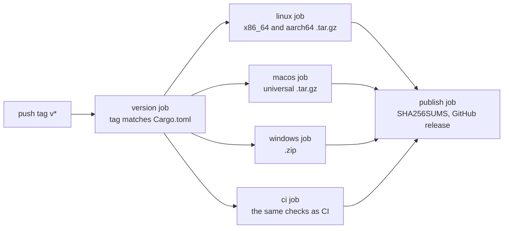

# Dev loop, build and release

> How do you get from a fresh clone to running koi, and from a tag to shipped downloads?

On Linux, a fresh clone needs Rust 1.90 or newer and the ALSA headers (`libasound2-dev`). Then `just run` builds and starts koi, `just test` runs the tests, and `just check` runs almost everything CI checks on Linux. `just` on its own lists every task. Without just, plain `cargo build --release` and `cargo test --workspace` work too.

A release starts when you push a tag like `v0.5.0`. GitHub Actions builds the archives on Linux, macOS and Windows, adds a checksum file, and publishes them as a GitHub release. The web page is separate: it is rebuilt and published from every push to `main`.

::: medium
### The command catalogue

The justfile is the list of things you do day to day. Each recipe's comment is its description, so `just` prints a readable menu:

@run just --list

Most recipes are a line or two that call cargo or a script in `scripts/`. `just run` passes its arguments to koi, so `just run --theme moonlit-pond` works.

### `just check` and CI

`check` is declared as `check: lint test` (`justfile:29-30`). It runs `lint` (formatting, and clippy with warnings as errors), then `test`, then builds the docs with warnings as errors. That's the same list as the Linux job in `.github/workflows/ci.yml:20-27`. `test` points the GPU parity test at lavapipe when it's installed (`justfile:5`), which is what CI does too. The verification card covers the tests themselves.

### The web page

`just site` runs `scripts/build-site.sh`, which compiles `koi-web` to wasm, generates its JavaScript bindings, and copies in `site/` and the three built-in tracks. The result lands in `target/site`. `just serve` builds it and serves it at `http://127.0.0.1:8123/`.

It needs a few extra tools, and `just web-tools` installs the Rust ones: the wasm target and `wasm-bindgen-cli`. The CLI must be the same version as the `wasm-bindgen` crate in `Cargo.lock`, and the build stops with the exact install command if it isn't (`scripts/build-site.sh:21-26`). ffmpeg and jq come from your package manager. wasm-opt is optional and makes the wasm smaller and faster.

### What a new machine needs

| To do | Install |
|---|---|
| Build and run koi | Rust 1.90+, `libasound2-dev` |
| Run every test | plus `mesa-vulkan-drivers`, for lavapipe |
| Build the web page | plus `just web-tools`, ffmpeg, jq |
| Build a Linux release | plus zig, cargo-zigbuild, jq |

### From tag to downloads

`.github/workflows/release.yml` runs on any tag starting with `v` (`.github/workflows/release.yml:5`). Each OS job runs the same `scripts/release.sh`, which picks its branch by `uname`. Every archive holds the binary, the README, both license files and a `THIRD-PARTY.md`.

Beside them, the `ci` job runs every CI check on the tagged commit (`.github/workflows/release.yml:75-78`). When the three builds and the checks have passed, the publish job gathers the archives, writes the checksums and creates the release:

@excerpt .github/workflows/release.yml:89-91

The web page doesn't wait for a tag. `.github/workflows/pages.yml` builds and smoke-tests it on every push to `main` and every pull request, but only deploys to GitHub Pages from `main` (`.github/workflows/pages.yml:49`).

::: check You push tag `v0.5.0`. What gets built, and where does each piece end up?
First the version job checks that `Cargo.toml` says 0.5.0, and stops everything if it doesn't. Then four archives: `koi-<version>-x86_64-linux.tar.gz` and `-aarch64-linux.tar.gz` from the Linux job, `-macos.tar.gz` from the macOS job, and `-windows-x86_64.zip` from the Windows job. The publish job adds `SHA256SUMS` and uploads all five files to a GitHub release named `koi v0.5.0` (`.github/workflows/release.yml:91`). If any CI check fails on that commit, nothing is published. The web page isn't touched by the tag. It was already deployed by the push to `main`.
:::
:::

::: high
### Link time and run time

A program that uses a shared library meets it twice. At **link time**, when the binary is built, the linker checks that every function the code calls exists in some library, and writes that library's name into the binary. At **run time**, when you start the program, the system's loader finds the real library by that name and connects the calls. The two don't have to be the same file. The linker only needs to see the names.

The Linux release uses that gap twice.

### One Linux binary for old and new distros

A Linux binary built on a new system asks for new versions of glibc, the C library, and won't start on older ones. `cargo-zigbuild` uses zig as the linker, and zig can target an older glibc. The target name carries the version (`scripts/release.sh:64`): `x86_64-unknown-linux-gnu.2.17` means "work on glibc 2.17 or newer", which includes distros as old as CentOS 7.

### The ALSA link stub

koi links against ALSA for sound. The runner has ALSA for x86_64, but not for aarch64, and cross-compiling normally needs the target's libraries. The script fakes one instead:

@excerpt scripts/release.sh:53-57 mark=54-55

1. Build koi normally on the host, then list the `snd_*` functions it calls, with their symbol versions, such as `snd_card_next@ALSA_0.9`.
2. Write a C file with an empty function for each name, and a version map that puts each name under its version.
3. Compile that into a fake `libasound.so` for each architecture, named `libasound.so.2` inside (`scripts/release.sh:61`), with a small `alsa.pc` so pkg-config finds it.

The linker sees every name at the right version and is satisfied. The binary records that it needs `libasound.so.2`. At run time the loader finds the user's real ALSA under that name, and the empty stubs are never used. Both architectures link against the stub, x86_64 included. The host build is only there to read the names.

::: inferred
The stub only has functions a host build calls. If a dependency update calls an ALSA function only on aarch64, that build would fail to link. That seems unlikely since the code is the same on both, and it would fail loudly rather than ship.
:::

### The macOS universal binary

The macOS job builds twice, once for Apple silicon and once for Intel, then joins them with `lipo` into one file that holds both (`scripts/release.sh:74`). macOS runs whichever half fits the machine.

### The `dist` profile

@excerpt Cargo.toml:64-68

It starts from the normal release settings and adds three. `lto = "fat"` optimizes across all crates at once. `codegen-units = 1` compiles each crate as one unit, so the optimizer sees more. Together they make builds slower and the binary smaller and a little faster. `strip` drops debug symbols. The web page's `web` profile below it is the same, plus `panic = "abort"`, which leaves the unwinding code out of the wasm.

### The music pack is its own release

The binary carries three songs. The full set of 19 is a separate release, tagged `music-v1` (`README.md:39`). `scripts/release.sh --music` downloads the tracks and packs them as `dist/koi-music.tar.gz` (`scripts/release.sh:86-93`).

::: inferred
The release workflow calls `scripts/release.sh` without `--music`, and `music-v1` doesn't match the `v*` trigger. So the music pack was built and uploaded by hand, and a code release never rebuilds it.
:::

### What `just check` leaves to CI

CI's `msrv` job also builds on Rust 1.90, the oldest version koi supports (`.github/workflows/ci.yml:96`). `just check` builds on whatever Rust you have, and says so in its description (`justfile:28`).

### The tag must match the version

The archive names come from the version in `Cargo.toml` (`scripts/release.sh:30`). So the release starts with a small job that fails unless the tag is `v` plus that version, before anything is built:

@excerpt .github/workflows/release.yml:10-19

The web page doesn't name a version. It links to the latest release and says which file fits which system, so it's never ahead of what's published.
:::
